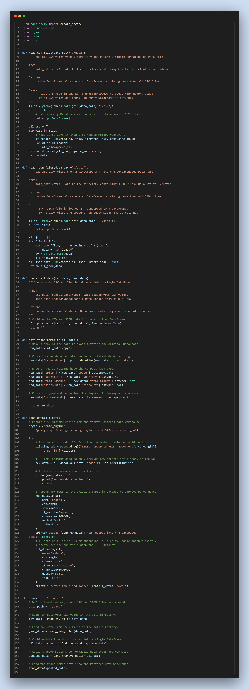
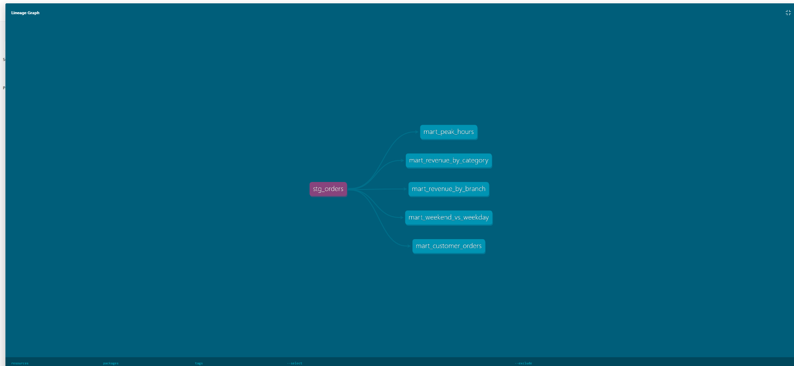
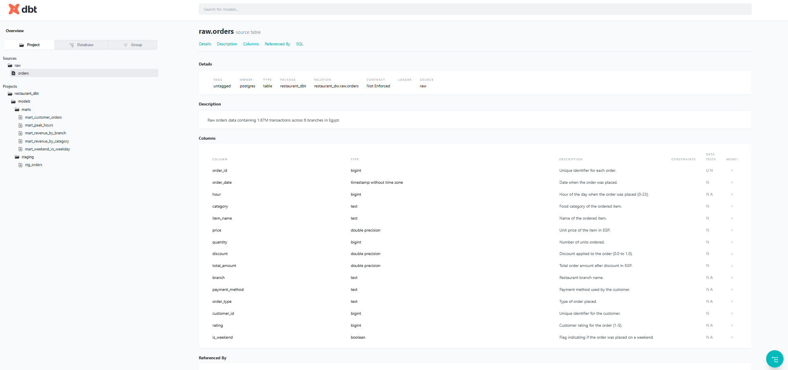
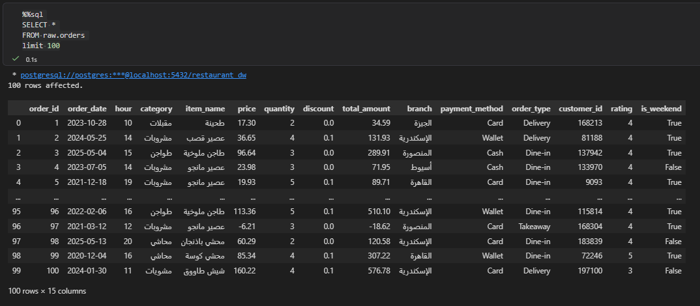

# 🍽️ Restaurant Analytics Pipeline

An end-to-end data pipeline that ingests, transforms, and analyzes **1.87 million restaurant orders** across 6 branches in Egypt.

**Built by:** [Abdelrhman Yassein](https://www.linkedin.com/in/abdelrhman-yassein/)

---

## 📐 Architecture

```
Raw Files (CSV + JSON)
        ↓
  Python Ingestion
  (pandas + sqlalchemy)
        ↓
  PostgreSQL Database
    (raw.orders)
        ↓
  dbt Transformations
  (staging → marts)
        ↓
  Analytics & Insights
```

---

## 📁 Project Structure

```
restaurant_pipeline/
├── data/                          # Raw CSV and JSON source files
│   ├── restaurant1.csv
│   ├── ...
│   ├── restaurant7.csv
│   ├── restaurant_json1.json
│   └── restaurant_json2.json
├── scripts/
│   └── load_data.py               # Python ingestion script
├── restaurant_dbt/                # dbt project
│   └── models/
│       ├── staging/
│       │   └── stg_orders.sql
│       └── marts/
│           ├── mart_revenue_by_branch.sql
│           ├── mart_revenue_by_category.sql
│           ├── mart_peak_hours.sql
│           ├── mart_customer_orders.sql
│           └── mart_weekend_vs_weekday.sql
├── resenv/                        # Python virtual environment
└── README.md
```

---

## 🛠️ Tech Stack

| Tool | Purpose |
|------|---------|
| Python (pandas, sqlalchemy) | Data ingestion & transformation |
| PostgreSQL | Data warehouse |
| dbt Core | Data modeling & testing |

---

## 📊 Dataset

- **11,110,000** total orders
- **6** branches: Cairo, Giza, Alexandria, Mansoura, Tanta, Assiut
- **199,987** unique customers
- Sources: 7 CSV files + 2 JSON files

---

## ⚙️ How to Run

### 1. Setup environment
```bash
cd restaurant_pipeline
python -m venv resenv
resenv\Scripts\activate        # Windows
pip install pandas sqlalchemy psycopg2-binary dbt-postgres
```

### 2. Setup PostgreSQL
```sql
CREATE DATABASE restaurant_dw;
CREATE SCHEMA raw;
```

### 3. Run Python ingestion
```bash
python scripts/load_data.py
```

### 4. Run dbt models
```bash
cd restaurant_dbt
dbt run
```

### 5. Run dbt tests
```bash
dbt test
```

---

## 🔍 Key Findings

| Insight | Detail |
|--------|--------|
| 🏆 Top Branch | Cairo — 170M+ EGP revenue |
| 💳 Most Used Payment | Cash (50% of orders) |
| ⏰ Peak Revenue Hours | 1 PM – 2 PM |
| 📅 Weekend vs Weekday | Weekend avg order value 33% higher (304 vs 228 EGP) |
| ⭐ Highest Rated Branch | Cairo (4.0 avg rating) |

---

## 🧪 Data Quality Tests

dbt tests applied on `raw.orders`:
- `unique` and `not_null` on `order_id`
- `not_null` on all critical columns
- `accepted_values` on: `branch`, `payment_method`, `order_type`, `rating`, `hour`, `is_weekend`

---

## 📸 Screenshots

| Step | Preview |
|------|---------|
| Data Load |  |
| Staging Model |  |
| dbt Documentation |  |
| Results |  |

---

## 📬 Contact

**Abdelrhman Yassein**
[LinkedIn](https://www.linkedin.com/in/abdelrhman-yassein/)
